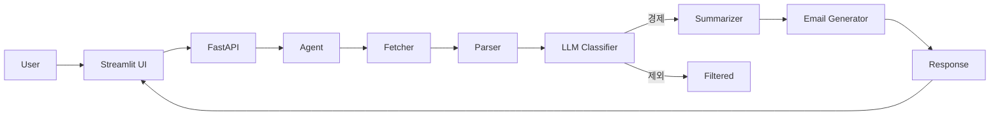
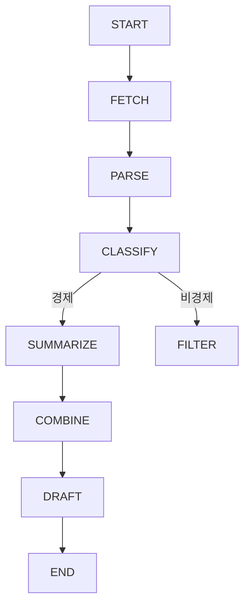
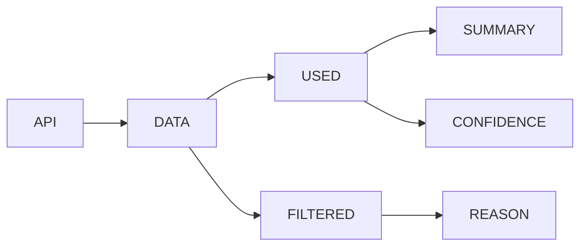

# Hankyung News Agent - System Design (Mermaid)

## 1. Architecture

```mermaid
flowchart LR
A[User] --> B[Streamlit UI]
B --> C[FastAPI]
C --> D[Agent]
D --> E[Fetcher]
E --> F[Parser]
F --> G[LLM Classifier]
G -->|경제| H[Summarizer]
G -->|제외| X[Filtered]
H --> I[Email Generator]
I --> J[Response]
J --> B
```

## 2. LangGraph Flow

```mermaid
flowchart TD
START --> FETCH --> PARSE --> CLASSIFY
CLASSIFY -->|경제| SUMMARIZE
CLASSIFY -->|비경제| FILTER
SUMMARIZE --> COMBINE --> DRAFT --> END
```

## 3. UI Flow

```mermaid
flowchart LR
API --> DATA
DATA --> USED
DATA --> FILTERED
USED --> SUMMARY
USED --> CONFIDENCE
FILTERED --> REASON
```
